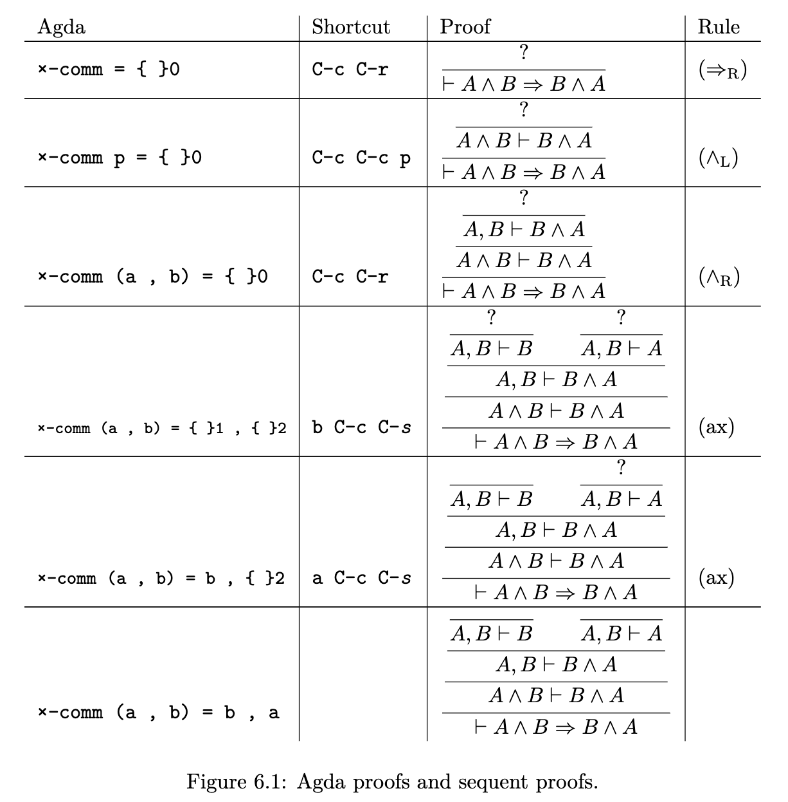

# Una introducción a una introducción de Agda
### García Fierros Nicky

## Introducción

Agda es tanto un lenguaje de programación (funcional) como un asistente de
pruebas (Vease [PROOF = PROGRAM - Samuel Mimram](https://www.lix.polytechnique.fr/Labo/Samuel.Mimram/teaching/INF551/course.pdf). De acuerdo con la [documentación
oficial de Agda](https://agda.readthedocs.io/en/v2.6.3/getting-started/what-is-agda.html), Agda es una extensión de la teoría de tipos de Martin-Löf, por lo que
su poder expresivo es adecuado para escribir pruebas y especificaciones de
objetos matemáticos. De esta forma, Agda también es una herramienta para la
formalización de las matemáticas. En tanto que para poder aprovechar todo el
poder de Agda como asistente de pruebas y herramienta de formalización de
matemáticas se requiere estudiar la teoría de tipos antes mencionada, en esta
breve pero concisa introducción no se tocarán los detalle; sin embargo
considero importante mencionar que, yo como autor, el acercamiento que he
tenido con la teoría de tipos de Martin-Löf y Agda ha sido gracias a la
teoría homotópica de tipos, de modo que mi forma de pensar sobre lo que se
presentará en este trabajo no podría empatar directamente con la teoría sobre
la cual se fundamenta Agda.

Hay mucho que decir sobre la relación entre la lógica, las categorías y los
tipos; sin emargo me limitaré a mencionar la correspondencia
Curry-Howard-Lambek por muy encima, y una breve mención de tipos dependientes y
su interpretación tanto lógica como categórica.

### Correspondencia Curry-Howard-Lambek

En **[The Formulae-As-Types Notion of Construction](https://www.cs.cmu.edu/~crary/819-f09/Howard80.pdf)**, un artículo escrito por el lógico Alvin Howard en
1980 menicona que Curry sugirió una relación entre los combinadores del
cálculo lambda y axiomas de la lógica. En este mismo escrito, Howard formaliza
las observaciones hechas por Curry. Por otro lado, a inicios de los 70's el
matemático Joachim Lambek demuestra que las categorías cartesianas cerradas y
la lógica combinatoria tipada comparten una teoría ecuacional en común.

La correspondencia es entonces

|     Tipos      |     Lógica     |      Categorías     |
| -------------  | -------------- | ------------------- |
|      𝟙         |       ⊤        |  Objeto terminal    |
|      𝟘         |       ⊥        |  Objeto inicial     |
|      →         |       ⊃        |  Flecha             |
|      ×         |       ∧        |  Producto           |
|      +         |       ∨        |  Coproducto         |

Es importante señalar que, a diferencia de la teoría de conjuntos, los tipos
producto y función son conceptos primitivos.

La forma de construir términos de un tipo producto coincide con aquella de la
teoría de categorías. Dados $a : A$ y $b : B$ podemos construir $(a , b) : A × B$.
Hablaremos un poco más sobre cómo "acceder" a los elementos que componen un tipo
producto cuando entremos bien en materia sobre usar a Agda como un asistente de
prueba.

Por otro lado, la forma de construir un tipo flecha es mediante un proceso de
**abstracción**. Si tenemos un término, y observamos que podemos abstraer cierto
comportamiento de interés, entonces podemos introducir un tipo flecha que
abstrae el comportamiento deseado, de forma análoga a como solemos hacerlo en
matemáticas. Si, por ejemplo, observamos que la sucesión 0, 1, 2, 4, 16, 32, ...
presenta un comportamiento cuadrático, podemos abstraer este comportamiento
escribiendo una representación simbólica de este en términos de nuestro lenguaje
matemático:
$$
f(x) = x^2
$$

Para restringir más dicho comportamiento en función de la clase de términos que
queremos considerar en nuestra abstracción, introducimos dominios y codominios.

$$
f : ℕ → ℕ
$$

de modo que sólo permitimos que $f$ "funcione" con naturales, y garantizamos que
tras hacer cualquier cómputo con $f$, el número que nos devuelve es un número
natural.

De forma análoga, el proceso de abstracción involucrado en la introducción
de un tipo flecha involucra un término `t : B`, del cual abstraemos `x : A`
y garantizamos que tras cualquier cómputo realizado con este tipo flecha
obtenemos otro término de tipo `B`. Expresamos esto con la siguiente
sintaxis:

```haskell
λx . t : A → B
```

### Π-types, Σ-types, lógica y categorías.

La teoría de tipos de Martin-Löf permite trabajar con tipos que dependen de
otros; es de esta forma que son **tipos dependientes**. Se introducen los tipos
de funciones dependientes, y los tipos coproducto.

#### Π-types

El HoTT Book menciona que los elementos (términos) de un tipo Π son funciones
cuyo tipo codominio puede variar según el elemento del dominio hacia el cual
se aplica la función. En virtud de este comportamiento familiar para aquellas
personas que han estudiado teoría de conjuntos es que reciben el nombre de Π,
pues el producto cartesiano generalizado tiene este mismo comportamiento.

Dado un conjunto $A$, y una familia $B$ indizada por $A$, el producto cartesiano generalizado es
$$
\prod\limits_{a ∈ A} B(a) = \{ f: A → \bigcup\limits_{a ∈ A}B(a)\ \vert\ ∀a ∈ A . f(a) ∈ B(a) \}
$$

En teoría de tipos escribimos `:` en lugar de `∈`, pero la sintaxis es prácticamente la misma.
Dado un tipo `A`, y una familia `B:A → Type`, podemos construir el tipo de funciones
dependientes

```haskell
Π(a:A) B(a) : Type
```

Intuitivamente, y en efecto así ocurre, si `B` es una familia constante, entonces

```haskell
Π(a:A) B(a) ≡ (A → B)
```

De esta forma, el tipo Π generaliza a los tipos flecha. Estos tipos además permiten el
polimorfismo de funciones. Una función polimorfa es aquella que toma un tipo como
argumento y actúa sobre los elementos de dicho tipo. Esto debería recordarle a usted
del ∀ en la lógica. Una observación pertinente es que los tipos producto se pueden
pensar como una versión "no dependiente" en cierto sentido de los tipos Π.

#### Σ-types

Así como los tipos Π generalizan a los tipos flecha, los tipos Σ generalizan a los
tipos producto, en tanto que permiten que el elemento en la "segunda coordenada"
dependa del elemento en la "primera coordenada". Obsevese que este comportamiento
es el mismo que permite el coproducto de la categoría de conjuntos (la unión disjunta).

```haskell
Σ(x:A) B(x)
```

Intuitivamente, y de nuevo es cierto que, si $B$ es constante, entonces
$$
\right( \sum\limits_{x : A} B \left) ≡ (A × B)
$$

Así como el tipo Π se puede identificar con el ∀ en lógica, el tipo Σ se puede
identificar con el cuantificador ∃. Una observación adicional pertinente
respecto a los tipos Σ es que los tipos + son una versión "no dependiente" en
cierto sentido de los tipos Σ.

### En resumen

Resumiendo algunos comentarios relevantes a esta pequeña introducción a la
teoría de tipos de Martin-Löf, tenemos la siguiente tabla.

| Tipos | Lógica | Categorías |
| ----- | ------ | ---------- |
| Σ     | ∃      | coproducto |
| Π     | ∀      | producto   |

## Probando tautologías de la lógica proposicional con Agda

El poder expresivo de la teoría de tipos de Martin-Löf (y por extensión la teoría
homotópica de tipos) permite identificar proposiciones matemáticas con tipos, y sus
demostraciones con términos de un tipo dado. De esta forma, si ocurre que el tipo
tiene por lo menos un término, entonces podemos permitir decir que tenemos una
demostración de dicha proposición.
En HoTT las proposiciones (de la lógica proposicional) corresponden a una clase
particular de tipos, en tanto que [en la lógica de primer orden no hay forma de distinguir entre una prueba de otra](https://homotopytypetheory.org/book/).
Estas tecnicalidades se mencionan con el propósito de incitar a la persona leyendo
o escuchando esto a investigar más por su cuenta, pues
para propósitos de esta exposición haremos uso del tipo `Set` de Agda, que renombraremos
a `Type` para hacer énfasis en este paradigma de "Proposiciones como tipos".

Iniciamos escribiendo al inicio de todo nuestro archivo con extensión `.agda` o `.lagda.md`
las siguientes cláusulas:

```agda

open import Data.Product renaming (_×_ to _∧_)

Type = Set

```

En la primera línea le pedimos a Agda por favor y con mucho cariño que de la
biblioteca estándar importe el tipo Product y que además renombre el operador `×`
a `∧`. En la segunda línea renombramos al tipo `Set` como `Type`.

Para pedirle a Agda, de nuevo por favor y con mucho cariño, que nos diga si
lo que hemos escrito hasta el momento está bien escrito y bien tipado
presionamos la combinación `C-c C-l` en emacs o en vscode con la extensión `agda-mode`.
Si todo está bien, deberíamos ver colorcitos en el código Agda que escribimos y
ningún mensaje al fondo de emacs o de vscode.

Ya con nuestro preámbulo listo, empecemos a demostrar pero no sin antes dar el crédito
correspondiente. La gran mayoría de cosas que se expondrán a continuación fueron tomadas
de las siguientes fuentes:

  * [Propositional Logic in Agda - Samuel Mimram](https://www.lix.polytechnique.fr/Labo/Samuel.Mimram/teaching/INF551/TD/5.propositional.html)
  * [The HoTT Game](https://homotopytypetheory.org/2021/12/01/the-hott-game/)
  * [Agda in a hurry - Martin Escardó](https://www.cs.bham.ac.uk/~mhe/fp-learning-2017-2018/html/Agda-in-a-Hurry.html)
  * [HoTTEST School Agda Notes - Martin Escardó](https://martinescardo.github.io/HoTTEST-Summer-School/)
  * [HoTT UF in Agda - Martin Escardó](https://www.cs.bham.ac.uk/~mhe/HoTT-UF-in-Agda-Lecture-Notes/HoTT-UF-Agda.html#contents)
  *[Proof = Program - Samuel Mimram](https://www.lix.polytechnique.fr/Labo/Samuel.Mimram/teaching/INF551/course.pdf)

#### Proposición
Sean $A, B$ proposiciones. Entonces $A ∧ B ⇔ B ∧ A$.

##### Demostración

Recordando que bajo nuestro paradigma en uso las proposiciones son tipos,
codificamos nuestra proposición como un tipo y, para demostrar la proposición
buscamos definir un término bien tipado del tipo de nuestra proposición.

```haskell
∧-comm : {A B : Type} → A ∧ B → B ∧ A
∧-comm = ？ 

```

Como no sabemos ni pío de Agda, le preguntamos a Agda qué opina que debería
ser la definición de nuestro término que, a final de cuentas será nuestra
prueba. Esto lo hacemos escribiendo el signo de interrogación despues de el signo
de igualdad. Si le pedimos a Agda que verifique si nuestro programa está bien tipado,
apareceran mensajes en la parte de abajo de emacs/vscode y los símbolos `{ }0` en
donde habíamos puesto nuestro preciado símbolo de interrogación. Estos símbolos
significan que ahí hay un **hueco de meta**.
Los mensajes leen

```haskell
?0 : A ∧ B → B ∧ A
```

Lo que denotan los símbolos `?0` es que nuestra meta `0` es la de producir un término
del tipo `A ∧ B → B ∧ A`. Podemos pedirle a Agda que nos de más información sobre nuestro
problema (Contexto y Meta) al posicionar el cursor en el hueco de meta
mediante la combinación de teclas `C-c C-,` en emacs.

Veremos que ahora nos muestra mensajes muy distintos a los anteriores.
Nos dice que en nuestra declaración del término que necesitamos debemos asumir que
`B` y `A` son tipos. Quizás para esta situación no es muy reveladora la información
que brinda Agda, pero en otras situaciones brinda información bastante útil.

Podemos pedirle a Agda que nos de más pistas, con base en la naturaleza de los
términos de los tipos que queremos producir. Para esto, de nuevo con el cursor en el hueco
de meta, presionamos la combinación de teclas `C-c C-r` en emacs/vscode para "refinar la meta".

```haskell

∧-comm : {A B : Type} → A ∧ B → B ∧ A
∧-comm = λ x → { }1

```

Al hacer esto, notamos que agda modifica el hueco y las metas se modifican acordemente.
Ahora nuestra meta es producir un término de tipo `B ∧ A`. Si volvemos a pedirle a Agda
el contexto y meta del problema, veremos que ahora tenemos a nuestra disposición
un término `x : A ∧ B`, con el cual podemos producir un término de tipo `B ∧ A`.
Si de nuevo le pedimos a Agda que refine la meta, tendremos ahora dos metas nuevas:
producir un término de tipo `B` y otro término de tipo `A`.

```haskell

∧-comm : {A B : Type} → A ∧ B → B ∧ A
∧-comm = λ x → { }1 , { }2

```

```haskell

∧-comm : {A B : Type} → A ∧ B → B ∧ A
∧-comm = λ x → {aa}0, {aa}1 

```

De aquí, podemos proceder de al menos tres formas distintas.
  * Podemos recordar que en la teoría de tipos de Martin-Löf (MLTT) el tipo producto
  es una noción primitiva, y por lo tanto Agda debe de implementar de forma "nativa"
  un eliminador izquierdo y derecho para el tipo producto.

  * Podemos probar un lema (redundante bajo la observación anterior)
  * Podemos aprovechar las bondades de Agda y su pattern matching para poder construir el término
  que queremos en virtud de la sintaxis que tienen los términos del tipo producto.

En tanto que para lo primero habría que irse a la documentación de Agda, y podríamos
usar lo tercero para probar el lema de la segunda opción, mejor probamos juntos el lema
y las otras opciones se quedan como ejercicio.

En MLTT, los términos del tipo producto se forman según el siguiente juicio:

```haskell

Γ ⊢ a : A      Γ ⊢ b : B
--------------------------[×-intro]
Γ ⊢ (a , b) : A × B

```

De esta forma, aprovechando el pattern matching de Agda podemos escribir la siguiente demostración
para el lema

#### Lema

Sean $A$, $B$ proposiciones. Entonces $A ∧ B ⊃ A$ y $A ∧ B ⊃ B$.


##### Demostración

```agda
∧-el : {A B : Type} → A ∧ B → A
∧-el (a , b) = ?

∧-er : {A B : Type} → A ∧ B → B
∧-er (a , b) = ?

```
Una observación pertinete es que al refinar y obtener los dos huecos anteriormente,
Agda nos está diciendo que utilicemos la regla de introducción del tipo producto, tal y como
lo hicimos al probar nuestro lema, para generar el término que deseamos. Entonces el proceso de
refinamiento de meta corresponde a aplicar una regla de introducción.

Ya armados con nuestro lema, podemos demostrar lo que queríamos en un inicio.
Para "darle" a Agda los términos tenemos dos opciones, que realmente son la misma:
  * Escribir sobre el hueco el término y luego presionar `C-c C-SPC` ó,
  * Presionar sobre el hueco `C-c C-SPC`.

Antes de rellenar ambos huecos, prueba usando la combinación `C-c C-n`
en alguno de los huecos, y escribiendo `∧-er x` o `∧-el x`. Encontrarás que Agda
**normaliza** el término que escribiste. Al escribir `∧-er x` regresa `proj₂ x` el cual
es el resultado de aplicar el eliminador "nativo" del tipo producto sobre el término `x`.
Tras darle a Agda los términos necesarios, terminamos nuestra prueba. 

```agda

∧-comm : {A B : Type} → A ∧ B → B ∧ A
∧-comm = ? 

```

En conclusión, el termino `∧-comm = λ x → (∧-er x) , (∧-el x)` es prueba/testigo de que
el tipo `∧-comm : {A B : Type} → A ∧ B → B ∧ A` no es vacío y por lo tanto es una proposición
"verdadera".

Notemos que esta demostración tiene su contraparte categórica.

Y también tiene su contraparte en el cálculo de secuentes.


#### Proposición

Sean $A, B$ proposiciones. Entonces $A ⊃ B ⊃ A$

##### Demostración

```agda

prop1 : {A B : Type} → A → B → A
prop1 = ?

```

#### Proposición

Sean $A, B, C$ proposiciones. Si $A ⊃ B$ y $B ⊃ C$ entonces $A ⊃ C$.

##### Demostración

```agda
-- Si uno tiene muchas ganas,
-- puede escribir la proposición en notación de cálculo de secuentes

→-trans : {A B C : Type}
          → (A → B)
          → (B → C)
          ------------
          → (A → C)

→-trans f g = ?
```
#### Proposición

Sea $A$ una proposición. Entonces $A ⊃ A$.

##### Demostración

```agda
id : {A : Type} → A → A

id = ?

```

#### Proposición

Sean $A, B$ proposiciones. Si $A ⊃ B$ y $A$, entonces $B$.

##### Demostración

```agda
→app : {A B : Type}
     → (A → B)
     → A
     ----------------[App/Modus Ponens]
     → B

→app f a = ?
```

#### Proposición
Sea $A$ una proposición. Entonces $A ⊃ A ∧ A$.

##### Demostración

```agda

Δ : {A : Type}
  → A
  -------------
  → (A ∧ A)


Δ a = ?
```

#### Proposición
Sean $A, B, C$ proposiciones. Entonces $A × B ⊃ C$ si y solo si $A ⊃ B ⊃ C$
(Hom(A × B, C) ≅ Hom(A, Cᴮ))
##### Demostración

```agda

currying : {A B C : Type}
          → (A ∧ B → C)
          ----------------
          → A → B → C
currying = ?

currying2 : {A B C : Type}
          → (A → B → C)
          ----------------
          → (A ∧ B → C)
currying2 = ?

```

Podemos definir el si y solo si.

```agda

_⇔_ : (A B : Type) → Type 
A ⇔ B = ?

```
#### Proposición

Sean $A, B, C$ proposiciones. Entonces $A ⊃ (B ∧ C) ⇔ ((A ⊃ B) ∧ (A ⊃ C)) 

##### Demostración

Para probar una doble implicación necesitamos dar una prueba de la ida y una prueba del regreso.
Para probar la ida podemos suponer que disponemos de un término del tipo t₁ : (A → (B ∧ C)) y
debemos construir un t₂ : ((A → B) ∧ (A → C)).
Para demostrar el regreso, debemos suponer que conamos con un término t₁ : ((A → B) ∧ (A → C))
y construir un t₂ : (A → (B ∧ C))

```agda
→-dist∧ : {A B C : Type} → (A → (B ∧ C)) ⇔ ((A → B) ∧ (A → C))
→-dist∧ = ?
```

### Disjunción

La disjunción es un tipo inductivo.

```agda
-- Cuando se tiene algo de la forma (A B : Type) estamos diciendole a Agda que queremos
-- explicitos los tipos. Cuando se tiene algo de la forma {A B : Type} le pedimos a agda
-- que infiera los tipos.

data _∨_ (A B : Type) : Type where
  left  : A → A ∨ B
  right : B → A ∨ B

```

Muchas veces, cuando un tipo suma está involucrado, es necesario separar por casos.
Esto se aprecia en la definición del tipo ∨, en tanto que un término de dicho tipo
en principio puede tener dos formas: dicho término pudo haber sido construido
mediante una aplicación de `left`, o mediante una aplicación de `right`. Por consiguiente,
debemos tomar en cuenta estos dos casos distintos en nuestras pruebas.

```agda

--{ Principio de demostración por casos }--

caseof : {A B C : Type}
         → (A ∨ B)
         → (A → C)
         → (B → C)
         ----------------[∨-elim]
         → C
 
caseof (left a∨b) c₁ c₂ = ?     -- Caso 1. Ocurre A
caseof (right a∨b) c₁ c₂ = ?    -- Caso 2. Ocurre B

```

#### Proposición

La disjunción es conmutativa.

##### Demostración

```agda

∨-comm : {A B : Type} → A ∨ B → B ∨ A
∨-comm (left a∨b) = ?
∨-comm (right a∨b) = ?

```
#### Proposición

La disjunción distribuye sobre la conjunción.

##### Demostración

```agda

∨-dist∧ : {A B C : Type}
          → (A ∨ (B ∧ C))
          -------------------
          → (A ∨ B) ∧ (A ∨ C)

∨-dist∧ (left a∨[b∧c]) = ?
∨-dist∧ (right a∨[b∧c]) = ?
```

### Negación

En la lógica proposicional, una proposición falsa es aquella que no se puede demostrar.
Por lo tanto, la definimos como tal.

```agda

data ⊥ : Type where

-- su contraparte es ⊤, el tipo cuyo sólo tiene un término.
data ⊤ : Type where
  ⋆ : ⊤

```

Observa que no tiene constructor alguno. Por lo tanto no hay forma de construir un término
de ⊥.

#### Principio de explosión

Si $A$ es una proposición, entonces $⊥ ⊃ A$.

#### Demostración

```agda

⊥-e : {A : Type}
      → ⊥
      -------------
      → A

⊥-e ()
```

Donde () es una "función vacía".

La negación de una proposición es un operador que recibe una proposición
y nos regresa otra proposición.

```agda
¬ : Type → Type
¬ T = ?
```

#### Proposición
Sean $A, B$ proposiciones. Si $A ⊃ B$ y $¬B$, entonces $¬A$.

##### Demostración

```agda
¬impl : {A B : Type}
        → (A → B)
        → ¬ B
        -------------
        → ¬ A

¬impl a→b ¬b a = ?

```

#### Proposición
Sea $P$ una proposición. Entonces $¬(P ∧ ¬P)$.

##### Demostración

```agda

no-contr : {P : Type}
           -----------
           → ¬(P ∧ ¬ P)

no-contr p∧¬p = ?

```
Nuestra prueba refleja la siguiente deducción.

```haskell
 {P : Type}
 ⊢ P ∧ ¬ P
 -----------
 ⊢ ⊥
```
pero eso es justo lo que nos pide la definición de la negación.

#### Proposición

Sea $A$ una proposición. Entonces $A ⊃ ¬(¬ A)$.

##### Demostración

```agda
¬¬I : {A : Type}
      → A
      -----------
      → ¬(¬ A)
¬¬I a = ?
```

#### Proposición

Sean $A, B$ proposiciones. Si $¬A$ y $A$ entonces $B$.

##### Demostración

```agda
-- Observa que por currying da igual escribir "¬A" y "A" a escribir
-- ¬A ⊃ A.

¬e : {A B : Type}
     → ¬ A
     → A
     --------------
     → B

¬e ¬a a = ?

```

#### Proposición

Sean $A, B$ proposiciones. Entonces
  
  * $(¬ A ∧ ¬ B) ⊃ ¬ (A ∨ B)$
  * $¬ (A ∨ B) ⊃ (¬ A ∧ ¬ B)$
  * $(¬ A ∨ ¬ B) ⊃ ¬ (A ∧ B)$
  * $¬ (A ∧ B) ⊃ (¬ A ∨ ¬ B)$
  
##### Demostración

```agda
¬∧¬→¬∨ : {A B : Type}
         → ¬ A ∧ ¬ B
         -----------
         → ¬ (A ∨ B)

¬∧¬→¬∨ ¬a∧¬b a∨b = ?
¬∨→¬∧¬ : {A B : Type}
         → ¬ (A ∨ B)
         ------------
         → ¬ A ∧ ¬ B

¬∨→¬∧¬ ¬[a∨b] = ?

¬∨¬→¬∧ : {A B : Type}
         → ¬ A ∨ ¬ B
         ------------
         → ¬ (A ∧ B)
         
¬∨¬→¬∧ ¬a∨¬b a∧b = ?

-- ¬∧→¬∨¬' : {A B : Type}
--      → ¬ (A ∧ B)
--      -------------
--      → (¬ A ∨ ¬ B)

-- ¬∧→¬∨¬' ¬a∧b = ?


```

### Matemáticas no constructivas

#### La Ley del Tercer Excluido y la doble negación.

El marco teórico bajo el cual trabaja Agda está basado en la lógica
intuicionista. En virtud de la equivalencia de implicación
$$
¬(A ∧ B) ⊃ ¬A ∨ ¬B
$$
con el lema del tercer excluido:
$$
A ∨ ¬A ⊃ ⊤
$$
no podemos terminar de demostrar las equivalencias de De Morgan. Si en verdad
queremos con toda nuestra alma emplear el lema del tercer excluido,
podemos introducirlo como un postulado de la siguiente forma:

  * [README.Case](http://agda.github.io/agda-stdlib/README.Case.html#1) 

```agda

postulate LEM : {A : Type} →  A ∨ ¬ A

lemma1 : {A : Type} → ¬ (¬ (¬ A)) → ¬ A
lemma1 ¬[¬¬a] a = →app ¬[¬¬a] (¬¬I a)

dnn : {A : Type}
      → ¬(¬ A)
      ----------
      → A

dnn {A} ¬¬a = ?

```

¿Puedes probar la equivalencia de DeMorgan restante con estas herramientas
no constructivas?

```agda
-- ¬∧→¬∨¬ : {A B : Type}
--      → ¬ (A ∧ B)
--      -------------
--      → ¬ A ∨ ¬ B

-- ¬∧→¬∨¬ = ? 

```

## Enunciados con predicados: una introducción a los tipos dependientes

En esta sección codificaremos a los números naturales en Agda y demostraremos
algunas propiedades sobre los objetos que vayamos construyendo.

#### Definición

Una familia de tipos es una función que manda términos en tipos.

##### Ejemplo

```agda

data Bool : Type where
  true : Bool
  false : Bool

-- D es una familia de tipos indizada por Bool.

D : Bool → Type
D true = ?
D false = ?

--- Los tipos dependientes nos permiten definir familias de funciones para cada Tipo
--- Esto se conoce como polimorfismo

-- Observa que esta función recibe como parámetro una familia de tipos (X : Bool → Type)
-- "Para todo b : Bool, define cómo se comporta X b".
if[_]_then_else_ : (X : Bool → Type)
                   → (b : Bool)
                   → X true
                   → X false
                   → X b

-- si b es true, entonces actúa según la familia en true.
if[ X ] true then x else y = ?
-- si b es false, entonces actúa según la familia en false.
if[ X ] false then x else y = ?

```

$$
  \prod\limits_{b : Bool} D(b)
$$

Definimos a los números naturales como un *tipo inductivo**.

```agda

data ℕ : Type where
  zero : ℕ
  suc  : ℕ → ℕ

```
La definición es inductiva:
  * La clausula base      : `zero` es un término de ℕ
  * La clausula inductiva : si `t : ℕ` entonces `suc t : ℕ`.

Por conveniencia y eficiencia, le pedimos a Agda que utilice los símbolos con los que
estamos familiarizados para denotar a los números naturales en lugar de escribir
`suc (suc (suc … (suc zero) … ))` para denotar a un número.

```agda

{-# BUILTIN NATURAL ℕ #-}

```

Con la instrucción anterior, Agda se apoya en la implementación de los números
naturales con la que viene Haskell.

Ya con otro tipo más interesante, podemos jugar con nuestra función anterior

```agda
fam : Bool → Type
fam true = ℕ
fam false = Bool

fun : (b : Bool) → fam b
fun b = if[ fam ] b then 6 else false

-- Podemos permitir que los tipos que devuelve una función no sean los mismos :D
```

Ya que estamos un poco más familiarizados con los tipos dependientes codifiquemos
el principio de inducción matemática en Agda para números naturales.

### Principio de Inducción

Sea $φ$ una propiedad de los números naturales. Si $φ(0)$ y $φ(n) ⊃ φ(n+1)$ entonces
$∀ k ∈ ℕ : φ(k)$.

-------------

Para codificar una propiedad de los números naturales arbitraria, podemos hacerlo
con una familia de tipos indizada sobre ℕ, de modo que `{φ : ℕ → Type}` jugará el papel
de una propiedad sobre ℕ. Luego, necesitamos construir dos términos en virtud de lo que
queremos demostrar: un término para φ(0); `φ 0`; y un término para φ(n) ⊃ φ(n+1);
`(n : ℕ) → φ n → φ (suc n)`; esto se puede leer como "$∀ n ∈ ℕ . (φ(n) ⊃ φ(n+1))$".
Nuestra meta entonces es construir un término o testigo de
`(k : ℕ) → φ n`; que se puede leer como "$∀ k ∈ ℕ . φ(k)$".

> Nota sobre la notación: [agda function-types](https://agda.readthedocs.io/en/v2.5.2/language/function-types.html)

```agda

ℕ-elim : {φ : ℕ → Type}
         → φ zero
         → ((n : ℕ) → φ n → φ (suc n))
         ------------------------------
         → ∀ (k : ℕ) → φ k                 ---- Es lo mismo que sólo escribir (k : ℕ) → φ k pero
                                           ---- se ve perron jajaja (TODO Borrar esto jaja)

---- Sup. que ocurren las dos hipótesis.
---- Queremos construir un testigo de la conclusión a partir de estas hip.

ℕ-elim {φ} φ₀ f = ?
```

Una prueba más elegante:

```agda

Nat-elim : {φ : ℕ → Type}
           → φ 0
           → ((k : ℕ) → φ k → φ (suc k))
           --------------------------------
           → (n : ℕ) → φ n


Nat-elim {φ} φ₀ f zero = φ₀
Nat-elim {φ} φ₀ f (suc x) = f x (Nat-elim φ₀ f x)
    
```

De acuerdo con Martin Escardó, esta es la única definición recursiva en toda la teoría
de tipos de Martin Löf. Cualquier otra llamada recursiva tiene que ser propia de la
regla de eliminación del tipo inductivo.

Ahora que ya tenemos nuestro tipo de números naturales y una forma de hacer inducción
sobre estos, utilicemos estas construcciones para demostrar cosas sobre ℕ.

### La suma, el producto y el orden en ℕ

Definimos la suma de forma inductiva.

#### Definición:

La suma en ℕ se define como a continuación.

```agda

_+_ : ℕ → ℕ → ℕ
-- casos en m en m + n = ?
n + m = ?

_·_ : ℕ → ℕ → ℕ

zero · n = zero
(suc m) · n = (m · n) + n

_≤_ : ℕ → ℕ → Type
x ≤ y = ?
```
[nat_sum]!(/Users/nicky/Working Directory/Servicio Social/PresentacionAgda/nat_sum_conm.png)

### Una introducción al tipo identidad.

La igualdad entre dos objetos matemáticos generalmente es una proposición.
Si los objetos en cuestión satisfacen nuestra definición de igualdad, entonces
podemos dar una prueba de dicha igualdad; la experiencia muestra que esto no siempre
es trivial; en otro caso, no podemos dar prueba de este hecho.

Para decidir la igualdad entre dos números naturales, por construcción necesitamos
verificar tres casos:

  * ambos son cero
  * alguno de los dos son cero
  * sus sucesores son iguales.

Entonces, dados dos números naturales, siguiendo nuestro paradigma de proposiciones como tipos,
definimos el tipo igualdad de dos números naturales.

```agda

_≡'_ : ℕ → ℕ → Type
zero ≡' zero = ⊤
zero ≡' suc b = ⊥ -- el cero no es sucesor de nadie
suc a ≡' zero = ⊥ -- no tenemos reflexividad todavia. Mismo caso que el anterior.
suc a ≡' suc b = a ≡' b -- si sus sucesores son iguales, entonces inductivamente decidimos.

```

Existe una forma más general de definir la igualdad para cualesquier tipo, y es mediante
el tipo identidad. El razonamiento básico detrás de la definición es la siguiente:

> Bajo el paradigma de Tipos como Proposiciones, como ya se discutió antes, tiene sentido
pensar en la igualdad como un tipo más. Sin embargo, queremos definir la igualdad para
cualquier tipo. ¿Cómo definimos este tipo? La información básica para decidir la igualdad
entre dos objetos es la siguiente: necesitamos la clase de objetos con los que estamos lidiando,
esto es el tipo de los objetos a comparar, a saber `T`, y necesitamos dos objetos a comparar,
esto es, `x : T` y `y : T`. Dada esta información, el tipo igualdad `x = y` es un tipo que
depende de los términos `x` y `y`. Por lo tanto `x = y` debe ser un tipo dependiente.
Si `p : x = y`, entonces es porque `p` es testigo de la igualdad; en otras palabras,
`p` es una identificación de `x` y de `y`. Si `p, q : x = y`, entonces debemos poder formar
también el tipo `p = q`. De esta forma, podemos emplear a los tipos para decir cosas sobre
la igualdad (¿será que dos identificaciones también pueden identificarse entre si?, ¡pensar en
homotopía!). Finalmente, la propiedad fundamental que satisfacen todas las nociones de igualdad
es una de reflexividad. Se codifica al tipo identidad entonces como un tipo inductivo
dependiente con un constructor que debe testificar la reflexividad, con el propósito de dotar
de estructura inductiva y de tipo con el fin de hacer más rica la discusión sobre la igualdad
en la teoría.

Aunque la discusión dada en esta exposición es quizás un poco larga, el tema de igualdad
es uno muy rico en contenido y discusión dentro de la teoría homotópica de tipos. Se hace
la cordial invitación a leer más sobre el tema en las referencias.

```agda
-- Dados un tipo T, para cada dos x , y : T
-- tenemos un tipo x ≡ y llamado tipo identidad de x a y.
data _≡_ {T : Type} : T → T → Type where
  refl : (x : T) → x ≡ x

-- x ≡ y es la proposición "x = y según T", y para cada x tenemos una prueba de que x es
-- igual a x según T.
```
Probemos la reflexividad de ≡.

#### Proposición
≡ es transitiva y simétrica.

##### Demostración

```agda

≡-sym : ∀ {T : Type} {n m : T}
        → n ≡ m
        -----------
        → m ≡ n

-- n ≡ m fue construido como `refl n`
-- para construir m ≡ n basta entonces hacer lo mismo, en tanto que n ≡ m.
-- es decir, tanto m y n están identificados internamente en T.
≡-sym (refl n) = refl n

≡-trans : ∀ {A : Type} {x y z : A}
          → x ≡ y
          → y ≡ z
          -------------------------
          → x ≡ z

-- como x ≡ y, y por hipótesis y ≡ z, entonces x y z deben estar
-- también identificados en x ≡ y
-- ≡-trans x≡y (refl y) = x≡y
≡-trans (refl x) (refl y) = refl x
```
Regresando a nuestras definiciones de suma, producto y orden; ya con
el tipo identidad y los tipos dependientes podemos demostrar propiedades sobre
estas operaciones.

#### Lema:
  * ∀ A B : Type . ∀ f : A → B . ∀ x y : T . x ≡ y ⇒ f x ≡ f y 
  * ∀ n ∈ ℕ . n + 0 = n
  * ∀ n ∈ ℕ . 0 + n = n
  * ∀ n, m ∈ ℕ . n + suc m = suc (m + n)

##### Demostración:

```agda

cong : ∀ {A B : Type} (f : A → B) {x y : A}
       → x ≡ y
       --------
       → f x ≡ f y
cong f ig1 = ?

zero+n-=-n : ∀ (n : ℕ) → (zero + n) ≡ n
zero+n-=-n n = ?

n+zero-=-n : ∀ (n : ℕ) → (n + zero) ≡ n
n+zero-=-n n = ?


-- Doble inducción sobre n y m :D

+-suc : ∀ (n m : ℕ) → (suc m + n) ≡ suc (m + n)

+-suc n m = ?

```

#### Proposición:
La suma en ℕ es conmutativa.

##### Demostración

```agda

+-conm : ∀ (x y : ℕ) → (x + y) ≡ (y + x)

+-conm x y = ?
```

#### Proposición

x ≤ y ⇔ ∃ k : ℕ . x + k = y

##### Demostración

```agda
open import Agda.Builtin.Sigma

-Σ = Σ
infix 2 -Σ
syntax -Σ A (λ x → B) = ∃ x ∈ A , B 

_~_ : ℕ → ℕ → Type

a ~ b = ∃ k ∈ ℕ , (a + k) ≡ b 

~-es-≤ : ∀ (a b : ℕ)
         → a ≤ b
         -----------
         → a ~ b

~-es-≤ desig1 = ?
```

# Esto concluye la presentación.
## ¡Muchas gracias por su atención!

